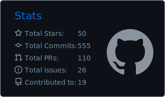
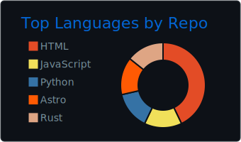
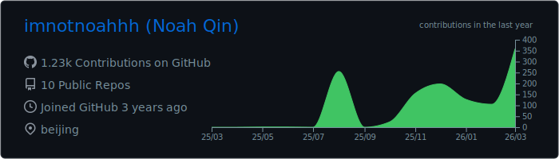

<div align="center">


<br>

[](https://www.noahnote.com)
[](mailto:qinfuyaoo@icloud.com)
[](https://x.com/NoahBuilds_)
[](https://github.com/imnotnoahhh)

</div>

---

### About Me

```python
class Noah:
    role = "High School Developer"
    location = "China"
    learning = ["Deep Learning", "PyTorch"]
    interests = ["ML Research", "Mobile Dev", "Web Dev"]
    fun_fact = "I think I am Weak LOL"
```

---

### Featured Projects

<table>
<tr>
<td width="50%">

**[Mole](https://github.com/imnotnoahhh/Mole)**
<br>
🐹 Deep clean and optimize your Mac.
<br>
`Shell`

</td>
<td width="50%">

**[Rethinking-Augmentation](https://github.com/imnotnoahhh/Rethinking-Augmentation)**
<br>
Official PyTorch implementation of "When More is Not Better: Rethinking Data Augmentation under Small-Sample Regimes". Discover why simple > complex in low-data settings.
<br>
`Python`

</td>
</tr>
<tr>
<td width="50%">

**[personal-blog](https://github.com/imnotnoahhh/personal-blog)**
<br>
`Astro`

</td>
<td width="50%">

**[vex](https://github.com/imnotnoahhh/vex)**
<br>
A fast, multi-language version manager for macOS
<br>
`Rust`

</td>
</tr>
<tr>
<td width="50%">

**[MoleUI](https://github.com/imnotnoahhh/MoleUI)**
<br>
Native macOS GUI for tw93/Mole, built with SwiftUI
<br>
`Swift`

</td>
<td width="50%">

**[More Projects →](https://github.com/imnotnoahhh?tab=repositories)**

</td>
</tr>
</table>

---

### Tech Stack

<div align="center">


<br>


</div>

---

### GitHub Activity

<table align="center" border="0" cellpadding="0" cellspacing="0">
<tr>
<td></td>
<td></td>
</tr>
<tr>
<td colspan="2"></td>
</tr>
</table>
